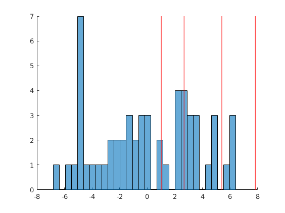
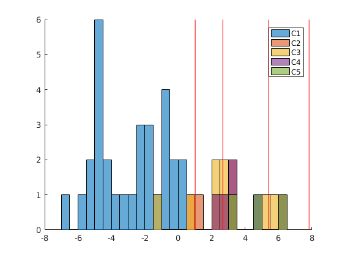
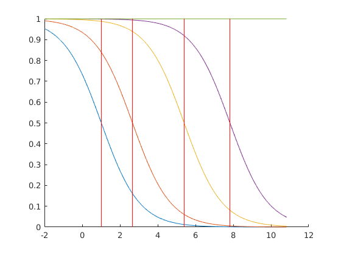
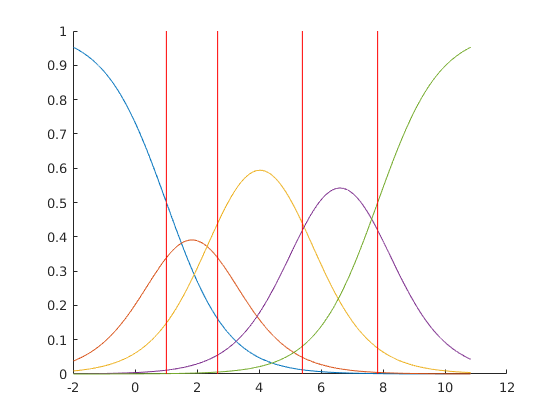
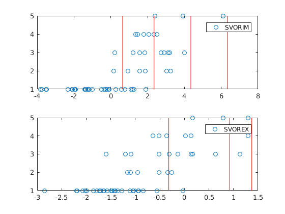
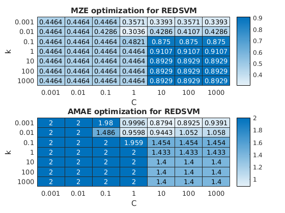
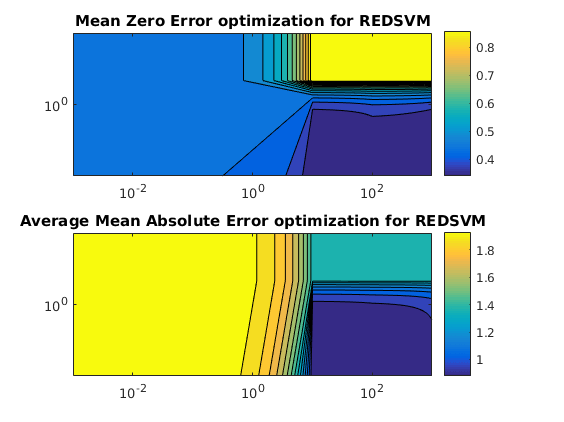
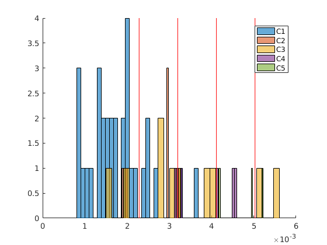
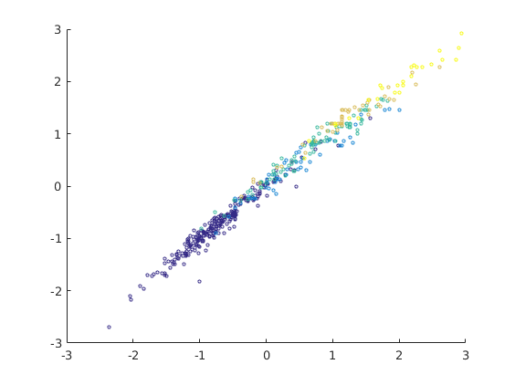

<!-- TOC depthFrom:1 depthTo:6 withLinks:1 updateOnSave:1 orderedList:0 -->

- [Threshold models](#threshold-models)
	- [Proportional odds model (POM)](#proportional-odds-model-pom)
	- [Neural network based on POM (NNPOM)](#neural-network-based-on-pom-nnpom)
	- [Support vector for ordinal regression (SVOREX and SVORIM)](#support-vector-for-ordinal-regression-svorex-and-svorim)
	- [Reduction from ordinal regression to binary SVM classifiers (REDSVM)](#reduction-from-ordinal-regression-to-binary-svm-classifiers-redsvm)
	- [Kernel discriminant learning for ordinal regression (KDLOR)](#kernel-discriminant-learning-for-ordinal-regression-kdlor)
	- [Ordinal regression boosting (ORBoost)](#ordinal-regression-boosting-orboost)
	- [Custom Ensemble based on several projections](#custom-ensemble-based-on-several-projections)
- [References](#references)

<!-- /TOC -->

# Threshold models

This tutorial will cover how to apply threshold models in the framework ORCA. It is highly recommended to have previously completed the [how to tutorial](orca-tutorial.md).

Moreover, we are going to work again with melanoma diagnosis dataset. You should complete at least [the second section of the second tutorial](orca-tutorial2.md#loading-the-dataset-and-performing-some-preliminary-experiments) in order to follow this third tutorial.

All threshold models are designed with a very reasonable idea: the categories to be predicted in ordinal classification comes from the discretization of an underlying latent variable, so that we can try to model the latent variables and use a total of Q-1 thresholds (for Q classes) to divide this variable in categories. In this way, the order of categories will be taken into account, because the intervals defined for each will be arranged in the same order, and a lot of flexibility will be given to the model by simply moving these thresholds.

Because of this, there are many threshold model proposals in the literature, and ORCA includes some of the most popular ones:
- One linear model (POM) [1].
- One neural network model (NNPOM) [1,2].
- Two support vector machine proposals (SVOREX and SVORIM) [3].
- One reduction from ordinal regression to binary SVM (REDSVM) [4].
- One discriminant analysis proposal (KDLOR) [5].
- One ensemble model (ORBoost) [6].

The corresponding script for this tutorial, ([exampleMelanomaTM.m](../src/code-examples/exampleMelanomaTM.m)), can be found and run in the [code example](../src/code-examples). Octave code is not shown here to simplify code, but it is included in ([exampleMelanomaTM.m](../src/code-examples/exampleMelanomaTM.m)).

## Proportional odds model (POM)

The POM arose from a statistical background, and it is based on an extension of binary logistic regression. Instead of using one single threshold to discriminate negative and positive class, the model include as many thresholds as the number of classes minus one. The model uses one logistic function for each class, where the thresholds are arranged in ascending order and the linear part (projection vector) is common for all of them.

A strong probabilistic basis is inherent to this approach: each logistic function is modelling the cumulative probability that a pattern has of belonging to the corresponding class or any of the previous classes. Cumulative probabilities can be easily transformed to standard probabilities by simply subtracting them.

We can try the POM model using the melanoma dataset to check its performance. This method does not involve any parameter. Run the following commands (from the [code-examples folder](/src/code-examples):
```MATLAB
>> addpath ../
addpath ../Measures
addpath ../Algorithms
>> % Disable warnings
warning('off','MATLAB:nearlySingularMatrix')
warning('off','stats:mnrfit:IterOrEvalLimit')
>> % Loading the data
trainMelanoma = load('../../exampledata/10-fold/melanoma-5classes-abcd-100/matlab/train_melanoma-5classes-abcd-100.5');
testMelanoma = load('../../exampledata/10-fold/melanoma-5classes-abcd-100/matlab/test_melanoma-5classes-abcd-100.5');
>> % Form structures for training/test
train.patterns = trainMelanoma(:,1:(end-1));
train.targets = trainMelanoma(:,end);
test.patterns = testMelanoma(:,1:(end-1));
test.targets = testMelanoma(:,end);
>> % Preprocess the data
[train,test] = DataSet.deleteConstantAtributes(train,test);
[train,test] = DataSet.standarizeData(train,test);
[train,test] = DataSet.deleteNonNumericValues(train,test);
>> %% Apply POM model
% Create the POM object
algorithmObj = POM();

% Train POM
info = algorithmObj.runAlgorithm(train,test);

% Evaluate the model
fprintf('POM method\n---------------\n');
fprintf('POM Accuracy: %f\n', CCR.calculateMetric(test.targets,info.predictedTest));
fprintf('POM MAE: %f\n', MAE.calculateMetric(test.targets,info.predictedTest));
POM method
---------------
POM Accuracy: 0.660714
POM MAE: 0.464286
```

An accuracy of 66% is obtained in this fold using POM. Now, we can check the projection the model is doing and the set of thresholds.

```MATLAB
>> % Visualize the projection
figure; hold on;
h = histogram(info.projectedTest,30);
y1=get(gca,'ylim');
for i=1:size(info.model.thresholds,1)
    line([info.model.thresholds(i) info.model.thresholds(i)],y1,'Color',[1 0 0]);    
end
hold off;
```
which generates the following figure:



As can be checked no pattern is projected beyond the last threshold, so that the last class is ignored. Note that POM is a linear model and this can limit its accuracy. We can check this in the confusion matrix:
```MATLAB
>> confusionmat(test.targets,info.predictedTest)

ans =

    30     0     1     0     0
     1     2     3     0     0
     2     2     4     2     0
     0     2     3     1     0
     0     0     2     1     0
```

Moreover, we can recode the projections, so that the patterns of each class appear in different colours:
```MATLAB
>> % Visualize the projection with colors
figure; hold on;
Q = size(info.model.thresholds,1)+1;
for i=1:Q
    h = histogram(info.projectedTest(test.targets==i),'BinWidth',0.5);
end
y1=get(gca,'ylim');
for i=1:size(info.model.thresholds,1)
    line([info.model.thresholds(i) info.model.thresholds(i)],y1,'Color',[1 0 0]);    
end
%legend('C1','C2','C3','C4','C5');
legend(arrayfun(@(num) sprintf('C%d', num), 1:Q, 'UniformOutput', false))
hold off;
```
which generates the plot:



As can be observed the three patterns from the last class are never correctly classified.

We can also plot the probability estimations generated by POM, which are based on the `logit` function:

```MATLAB
% Visualize the cummulative probabilities
figure; hold on;
numPoints=300;
x = linspace(min(info.model.thresholds-3),max(info.model.thresholds+3),numPoints);
f = repmat(info.model.thresholds',numPoints,1) - repmat(x',1,Q-1);
cumProb = [1./(1+exp(-f)) ones(numPoints,1)]; %logit function
plot(x,cumProb,'-');
y1=get(gca,'ylim');
for i=1:size(info.model.thresholds,1)
    line([info.model.thresholds(i) info.model.thresholds(i)],y1,'Color',[1 0 0]);    
end
hold off;
```



```MATLAB
>> % Visualize the individual probabilities
figure; hold on;
prob = cumProb;
prob(:,2:end) = prob(:,2:end) - prob(:,1:(end-1));
plot(x,prob,'-');
y1=get(gca,'ylim');
for i=1:size(info.model.thresholds,1)
    line([info.model.thresholds(i) info.model.thresholds(i)],y1,'Color',[1 0 0]);    
end
hold off;
```



As can be seen, those projections close to the thresholds can be classified in different classes according to the probability distribution. However, following the spirit of threshold models, the implementation of POM included in ORCA classify the patterns according to their position with respect to the thresholds.

---

***Exercise 1***: POM is a member of the Cumulative Link Models (CLM) family, where a `logit` function is considered. Now, you can try other probability distributions used in this models, such as the following ones (table from the [documentation](https://cran.r-project.org/web/packages/ordinal/vignettes/clm_intro.pdf) of this [R package](https://cran.r-project.org/web/packages/ordinal/)):


Compare graphically the different results.

---

## Neural network based on POM (NNPOM)

The idea of NNPOM is to extend POM by considering a nonlinear projection, instead of a linear one. To do so, the projection function is a linear combination of nonlinear basis function (i.e. a neural network of one output node). As in NNOP, only one hidden layer is considered. Given that POM estimate a proper probability distribution, the cross entropy is used for gradient descent. The algorithm used for gradient descent is the iRProp+ algorithm.

Three parameters have to be specified in this case:
- Parameter `hiddenN`, number of hidden neurons of the model.
- Parameter `iter`, number of iterations for gradient descent.
- Parameter `lambda`, regularization parameter in the error function (L2 regularizer), in order to avoid overfitting.

```MATLAB
>> % Create the NNPOM object
algorithmObj = NNPOM();

% Train NNPOM
info = algorithmObj.runAlgorithm(train,test,struct('hiddenN',20,'iter',500,'lambda',0.1));

% Evaluate the model
fprintf('NNPOM method\n---------------\n');
fprintf('NNPOM Accuracy: %f\n', CCR.calculateMetric(test.targets,info.predictedTest));
fprintf('NNPOM MAE: %f\n', MAE.calculateMetric(test.targets,info.predictedTest));
NNPOM method
---------------
NNPOM Accuracy: 0.642857
NNPOM MAE: 0.500000
```

The source code of NNPOM clearly shows hot the prediction is performed, which clarify a lot the model:

```MATLAB
function [projected, predicted]= predict(obj,test,model)
    %PREDICT predicts labels of TEST patterns labels using MODEL.
    m = size(test,1);
    a1 = [ones(m, 1) test];
    z2 = a1*model.Theta1';
    a2 =  1.0 ./ (1.0 + exp(-z2));
    projected=a2*model.Theta2';

    z3=repmat(model.Thresholds,m,1)-repmat(projected,1,model.num_labels-1);
    a3T =  1.0 ./ (1.0 + exp(-z3));
    a3 = [a3T ones(m,1)];
    a3(:,2:end) = a3(:,2:end) - a3(:,1:(end-1));
    [M,predicted] = max(a3,[],2);            
end
```

In this case, the results are not very good and even a bit worse than POM. However, the configuration of the parameters is critical.

You can also examine the threshold obtained and the projections:

```MATLAB
>> info.model.Thresholds

ans =

   -0.0532    6.6890   14.5441   22.1281

>> info.projectedTest

ans =

  -12.5781
  -14.1549
  -10.0944
  -11.7794
   -4.7533
  -10.5340
   -5.4838
    0.1905
    6.0557
  -22.3671
   -4.4566
  -10.6283
  -16.6782
   -1.8267
  -19.1499
    2.0112
  -12.3217
   -4.8291
    1.9410
   -6.0391
   -7.4425
  -12.9263
   -4.7081
  -18.7905
   -4.4591
    3.7864
   -5.7989
  ...
```

---

***Exercise 2***: try to improve the results in this dataset by applying nested crossvalidation with an `ini` file.

---

## Support vector for ordinal regression (SVOREX and SVORIM)

Now we examine support vector approaches based on the threshold model structure. The main methods are:
- SVOREX, which is an ordinal formulation of the SVM paradigm, which computes discriminant parallel hyperplanes for the data and a set of thresholds by imposing explicit constraints in the optimization problem.
- SVORIM, which is similar but computes discriminant parallel hyperplanes for the data and a set of thresholds by imposing implicit constraints in the optimization problem.

Both are threshold models so that they obtain a projection together with a set of thresholds. In ORCA, they are implemented considering the RBF kernel. Consequently, the main parameters of both methods are:
- Parameter `C`, importance given to errors.
- Parameter `k`, inverse of the width of the RBF kernel.

We are going to test both methods:
```MATLAB
>> %% Apply the SVORIM model
% Create the SVORIM object
algorithmObj = SVORIM();

% Train SVORIM
info = algorithmObj.runAlgorithm(train,test,struct('C',10,'k',0.001));

% Evaluate the model
fprintf('SVORIM method\n---------------\n');
fprintf('SVORIM Accuracy: %f\n', CCR.calculateMetric(test.targets,info.predictedTest));
fprintf('SVORIM MAE: %f\n', MAE.calculateMetric(test.targets,info.predictedTest));

% Store projections and thresholds (we will used them later)
svorimProjections = info.projectedTest;
svorimProjectionsTrain = info.projectedTrain;
svorimThresholds = info.model.thresholds;

%% Apply the SVOREX model
% Create the SVOREX object
algorithmObj = SVOREX();

% Train SVOREX
info = algorithmObj.runAlgorithm(train,test,struct('C',10,'k',0.001));

% Evaluate the model
fprintf('SVOREX method\n---------------\n');
fprintf('SVOREX Accuracy: %f\n', CCR.calculateMetric(test.targets,info.predictedTest));
fprintf('SVOREX MAE: %f\n', MAE.calculateMetric(test.targets,info.predictedTest));

% Store projections and thresholds (we will used them later)
svorexProjections = info.projectedTest;
svorexProjectionsTrain = info.projectedTrain;
svorexThresholds = info.model.thresholds;

SVORIM method
---------------
SVORIM Accuracy: 0.642857
SVORIM MAE: 0.500000
SVOREX method
---------------
SVOREX Accuracy: 0.642857
SVOREX MAE: 0.589286
```
SVORIM results in better test MAE, while the accuracy is the same.

We can plot both projections by:

```MATLAB
>> %% Represent both projections and thresholds
figure; hold on;
subplot(2,1,1)
plot(svorimProjections,test.targets, 'o');
y1=get(gca,'ylim');
for i=1:size(svorimThresholds,2)
    line([svorimThresholds(i) svorimThresholds(i)],y1,'Color',[1 0 0]);    
end
legend('SVORIM');
subplot(2,1,2)
plot(svorexProjections,test.targets, 'o');
y1=get(gca,'ylim');
for i=1:size(svorexThresholds,2)
    line([svorexThresholds(i) svorexThresholds(i)],y1,'Color',[1 0 0]);    
end
legend('SVOREX');
hold off;
```



Fine tuning a bit the parameters, we can improve the results:

```MATLAB
>> %% Apply the SVORIM model improved
% Create the SVORIM object
algorithmObj = SVORIM();

% Train SVORIM
info = algorithmObj.runAlgorithm(train,test,struct('C',200,'k',0.001));

% Evaluate the model
fprintf('SVORIM method improved\n---------------\n');
fprintf('SVORIM Accuracy: %f\n', CCR.calculateMetric(test.targets,info.predictedTest));
fprintf('SVORIM MAE: %f\n', MAE.calculateMetric(test.targets,info.predictedTest));

SVORIM method improved
---------------
SVORIM Accuracy: 0.660714
SVORIM MAE: 0.464286
```

## Reduction from ordinal regression to binary SVM classifiers (REDSVM)

The reduction from ordinal regression to binary SVM classifiers (REDSVM) [4] is a method that can be categorized both as threshold method or as decomposition method. The hyper-parameters are the wellknown `k` and `C` of SVM variants.

```MATLAB
%% Apply the REDSVM model
% Create the REDSVM object
algorithmObj = REDSVM();

% Train REDSVM
info = algorithmObj.runAlgorithm(train,test,struct('C',10,'k',0.001));

% Evaluate the model
fprintf('REDSVM method\n---------------\n');
fprintf('REDSVM Accuracy: %f\n', CCR.calculateMetric(test.targets,info.predictedTest));
fprintf('REDSVM MAE: %f\n', MAE.calculateMetric(test.targets,info.predictedTest));
```

To better understand the relevance of parameters selection process, the following code optimizes parameters `k` and `C` using a 3Fold for each combination. Then, it plots corresponding validation results for `Acc` and `AMAE`. Note that the optimal combination may differ depending of the selected performance metric. Depending on your version of Matlab, a `contourf` or a `heatmap` is used for each metric.

```MATLAB
>> %% REDSVM optimization
clear T Ts;

Metrics = {@MZE,@AMAE};
setC = 10.^(-3:1:3);
setk = 10.^(-3:1:3);
% TODO: fix for Octave since table() is not supported
Ts = cell(size(Metrics,2),1);
nFolds = 3;
CVO = cvpartition(train.targets,'KFold',nFolds);
for m = 1:size(Metrics,2)
    mObj = Metrics{m}();
    fprintf('Grid search to optimize %s for REDSVM\n', mObj.name);
    bestError=Inf;
    if (~exist ('OCTAVE_VERSION', 'builtin') > 0)
      T = table();
    end
    for C=10.^(-3:1:3)
        for k=10.^(-3:1:3)
            error=0;
            for ff = 1:nFolds
                param = struct('C',C,'k',k);
                info = algorithmObj.runAlgorithm(train,test,param);
                error = error + mObj.calculateMetric(test.targets,info.predictedTest);

            end
            error = error / nFolds;
            if error < bestError
                bestError = error;
                bestParam = param;
            end
            param.error = error;
            if (~exist ('OCTAVE_VERSION', 'builtin') > 0)
              T = [T; struct2table(param)];
            end
            fprintf('.');
        end
    end
    if (~exist ('OCTAVE_VERSION', 'builtin') > 0)
      Ts{m} = T;
    end
    fprintf('\nBest Results REDSVM C %f, k %f --> %s: %f\n', bestParam.C, bestParam.k, mObj.name, bestError);
end

if (exist ('OCTAVE_VERSION', 'builtin') > 0)
  fprintf('This type of graphic is not supported in Octave\n');
else
if verLessThan('matlab', '9.2')
    % Use contours
    figure;
    hold on;
    for m = 1:size(Metrics,2)
        mObj = Metrics{m}();
        subplot(size(Metrics,2),1,m)
        x = Ts{m}{:,1};
        y = Ts{m}{:,2};
        z = Ts{m}{:,3};
        numPoints=100;
        [xi, yi] = meshgrid(linspace(min(x),max(x),numPoints),linspace(min(y),max(y),numPoints));
        zi = griddata(x,y,z, xi,yi);
        contourf(xi,yi,zi,15);
        set(gca, 'XScale', 'log');
        set(gca, 'YScale', 'log');
        colorbar;
        title([mObj.name ' optimization for REDSVM']);
    end
    hold off;
else
    % Use heatmaps
    fprintf('Generating heat maps\n');
    figure;
    subplot(2,1,1)
    heatmap(Ts{1},'C','k','ColorVariable','error');
    title('MZE optimization for REDSVM');

    subplot(2,1,2)
    heatmap(Ts{2},'C','k','ColorVariable','error');
    title('AMAE optimization for REDSVM');
end
end


Grid search to optimize Mean Zero Error for REDSVM
.................................................
Best Results REDSVM C 1.000000, k 0.010000 --> Mean Zero Error: 0.303571
Grid search to optimize Average Mean Absolute Error for REDSVM
.................................................
Best Results REDSVM C 10.000000, k 0.001000 --> Average Mean Absolute Error: 0.879355


```





## Kernel discriminant learning for ordinal regression (KDLOR)

This method adapts discriminant learning to the context of ordinal classification. The original discriminant learning problem is transformed by considering the minimum difference between the averages of two consecutive classes (in the ordinal scale). If this minimum difference is positive, the the classes are correctly ranked according to the projection.

After obtaining the projection, the thresholds are positioned in the mean point of the average projection of the classes they are separating. This makes the method quite sensitive to classes with low frequencies (being a good method for imbalanced ordinal regression problems).

You can use KDLOR with three different kernels (`rbf`, `sigmoid` or `linear`) and with different optimization engines for the problem to be solved (`quadprog`, `qp` or `cvx`). Please, take into account that the `cvx` engine is not included by default in ORCA, so you will have to [install it](http://cvxr.com/cvx/). These two parameters are specified in the constructor (with the parameters `optimizationMethod` and `kernelType`, respectively), as they are not intended to be fine tuned by cross validation. During the optimization, KDLOR needs the following three parameters:
- Parameter `C`, importance given to the minimum distance between average projections of classes.
- Parameter `k`, inverse of the width of the RBF kernel.
- Parameter `u`, constant summed to the main diagonal of the kernel matrix, aimed at avoiding singularities.

Let try KDLOR in the melanoma dataset:
```MATLAB
>> %% Apply the KDLOR model
% Create the KDLOR object
algorithmObj = KDLOR('kernelType','rbf');

% Train KDLOR
info = algorithmObj.runAlgorithm(train,test,struct('C',1,'k',0.001,'u',0.01));

% Evaluate the model
fprintf('KDLOR method\n---------------\n');
fprintf('KDLOR Accuracy: %f\n', CCR.calculateMetric(test.targets,info.predictedTest));
fprintf('KDLOR MAE: %f\n', MAE.calculateMetric(test.targets,info.predictedTest));
KDLOR method
---------------
KDLOR Accuracy: 0.607143
KDLOR MAE: 0.517857
>> MS.calculateMetric(test.targets,info.predictedTest)

ans =

    0.2000

>> confusionmat(test.targets,info.predictedTest)

ans =

    25     4     2     0     0
     2     3     1     0     0
     2     4     2     0     2
     0     1     2     3     0
     0     0     0     2     1

```
as previously discussed, because of the way the thresholds are derived, this method is quite robust for minority classes.

Let check it in the projections:

```MATLAB
>> % Visualize the projection with colors
figure; hold on;
Q = size(info.model.thresholds,1)+1;
for i=1:Q
    h = histogram(info.projectedTest(test.targets==i),30);
end
y1=get(gca,'ylim');
for i=1:size(info.model.thresholds,1)
    line([info.model.thresholds(i) info.model.thresholds(i)],y1,'Color',[1 0 0]);    
end
%legend('C1','C2','C3','C4','C5');
legend(arrayfun(@(num) sprintf('C%d', num), 1:Q, 'UniformOutput', false))
hold off;
```



---

***Exercise 3***: Compare the results obtained in KDLOR by using different kernel functions.

---

## Ordinal regression boosting (ORBoost)

Ordinal regression boosting (ORBoost) is a thresholded-ensemble model, which is composed of confidence functions, and their weighted linear combination is used as the one-dimensional mapping. A set of thresholds for this mapping is also included in the model and iteratively updated with the rest of parameters.

As proposed by the authors, the total number of ensemble members is set to `T=2000`, and normalised sigmoid functions are used as the base classifier, where the smoothness parameter is `gamma=4`. Large margin bounds of the classification error and the absolute error are derived, from which two algorithms are presented: ORBoost with all margins and ORBoost with left-right margins. The `weights` parameter in the constructor configures whether the All margins versions is used (`weights=true`) or the Left-Right margin is used (`weights=false`).

This is the code for running ORBoost with the melanoma diagnosis dataset:
```MATLAB
>> %% Apply the ORBoost model
% Create the ORBoost object
algorithmObj = ORBoost('weights',true);

% Train ORBoost
info = algorithmObj.runAlgorithm(train,test);

% Evaluate the model
fprintf('ORBoost method\n---------------\n');
fprintf('ORBoost Accuracy: %f\n', CCR.calculateMetric(test.targets,info.predictedTest));
fprintf('ORBoost MAE: %f\n', MAE.calculateMetric(test.targets,info.predictedTest));
Entering ORBoost Training
ORBoost method
---------------
ORBoost Accuracy: 0.571429
ORBoost MAE: 0.589286
```

## Custom Ensemble based on several projections

We can construct an ensemble by using the projection given by different models. In the following example, we combine the projections given by SVORIM and SVOREX method to construct a new dataset. With this dataset, we apply the POM algorithm:

```MATLAB
>> %% Make an ensemble with SVORIM and SVOREX. The final decission by POM
% Construct a new dataset with the projections
newTrain.patterns = [svorexProjectionsTrain' svorimProjectionsTrain'];
newTrain.targets = train.targets;
newTest.patterns = [svorexProjections' svorimProjections'];
newTest.targets = train.targets;
% Preprocess the dataset
[newTrain,newTest] = DataSet.deleteConstantAtributes(newTrain,newTest);
[newTrain,newTest] = DataSet.standarizeData(newTrain,newTest);
[newTrain,newTest] = DataSet.deleteNonNumericValues(newTrain,newTest);
% Train the final POM model
algorithmObj = POM();
info = algorithmObj.runAlgorithm(newTrain,newTest);
% Evaluate the ensemble
fprintf('SVORIM+SVOREX+POM method\n---------------\n');
fprintf('SVORIM+SVOREX+POM Accuracy: %f\n', CCR.calculateMetric(test.targets,info.predictedTest));
fprintf('SVORIM+SVOREX+POM MAE: %f\n', MAE.calculateMetric(test.targets,info.predictedTest))
SVORIM+SVOREX+POM method
---------------
SVORIM+SVOREX+POM Accuracy: 0.642857
SVORIM+SVOREX+POM MAE: 0.500000
```

If we check the dataset used for POM:
```MATLAB
>> scatter(newTrain.patterns(:,1),newTrain.patterns(:,2),7,newTrain.targets);

```



We can see that, although the correlation of both projections is quite high, some patterns can be refined by considering both projections.

---

***Exercise 4***: construct a similar ensemble but using different SVORIM projections with different subsets of input variables (a 40% of randomly chosen variables). The number of members of the ensemble should be as a parameter (try 50).

----

***Exercise 5***: construct a similar ensemble but using different SVORIM projections with different parameters for the `C` value.

---


# References

1. P. McCullagh, "Regression models for ordinal data",  Journal of the Royal Statistical Society. Series B (Methodological), vol. 42, no. 2, pp. 109–142, 1980.
1. M. J. Mathieson, "Ordinal models for neural networks", in Proc. 3rd Int. Conf. Neural Netw. Capital Markets, 1996, pp. 523-536.
1. W. Chu and S. S. Keerthi, "Support Vector Ordinal Regression", Neural Computation, vol. 19, no. 3, pp. 792–815, 2007. http://10.1162/neco.2007.19.3.792
1. H.-T. Lin and L. Li, "Reduction from cost-sensitive ordinal ranking to weighted binary classification" Neural Computation, vol. 24, no. 5, pp. 1329-1367, 2012. http://10.1162/NECO_a_00265
1. B.-Y. Sun, J. Li, D. D. Wu, X.-M. Zhang, and W.-B. Li, "Kernel discriminant learning for ordinal regression", IEEE Transactions on Knowledge and Data Engineering, vol. 22, no. 6, pp. 906-910, 2010. https://doi.org/10.1109/TKDE.2009.170
1. H.-T. Lin and L. Li, "Large-margin thresholded ensembles for ordinal regression: Theory and practice", in Proc. of the 17th Algorithmic Learning Theory International Conference, ser. Lecture Notes in Artificial Intelligence (LNAI), J. L. Balcazar, P. M. Long, and F. Stephan, Eds., vol. 4264. Springer-Verlag, October 2006, pp. 319-333.
